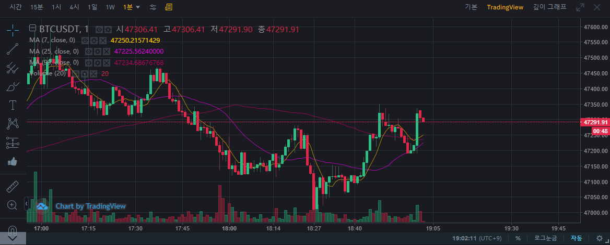

# 첫번째 매수

매수 사유 하락추세 및 볼렌저 밴드의 하방을 견디고 올라갈거라고 생각?  
하방이 계속 되었는데 저 자리에서 올라갈 거라고 판단

16시 20분쯤에 높은 거래량으로 올린것을 보고 매수세가 붙을거라고 생각  
그매 지점이 이전 하방은 지켜줄 거라고 판단 

16시 이전 저점이 점점 높아지고 있었다.

#btc 숏 진입

지속적으로 47k를 두드릴거 같음 
급락 하기 전

# btc 숏 매도

수익 1.6
 
매도 사유: 47k를 지속 적으로 두드리는 모습을 보일 거 같았음

---
# # btc 롱 매수

수익 11.2
 
원래 첫번째 매수 잡았을 때 방향성을 잘못잡아서 수익 구간이면 바로 정리하려 했는데 운 좋게 거래량이 따라 붙어주면서 11달러 이득을 봤다.

12.2달러
---
# btc 롱 매수

47.1은 버텨줄거라는 생각에 매수 25이평과 6시 10분쯤자리를 보고 들어감

# btc 롱 매도
btc 47,225 -> 47,288

수익 11.9
 

총 수익 24.7
 

# btc 롱 매수
btc 삼각 수렴후 16시 16분 이후 자리는 지켜줘야 함 

# btc 롱 매도
btc 47,276 -> 47,338

수익 11.7
 

총 수익 26.4</script>
 

# btc 숏 진입

상향에 있는 지지선들이 전체적 하락 분위기에서의 고점이라 숏이 더 타당해 보임
47.2 깨는 모습을 보일거라 예상 47.3은 올리기 힘들거 같다
27.5를 세번째 도전 하는 자리이지만 쉽지 않을거라 판단(15분봉)

# btc 롱 진입 & 매도
숏을 잡은 후 강한 매수를 보여주면서 말아 올렸다. 해당 시간대에 흐름상 올라간녀석은 내려가는 모습을 잘 보여주지 않았다. 사자 마자 매도

수익 12.0
 

총 수익 38.4</script>
 

# btc 롱 진입 & 매도
47,443 -> 47.463매도

수익 4.5
 

총 수익 42.9</script>
 

# btc 롱 진입 & 매도
47,400 -> 47,440

수익 8.0
 

총 수익 50.9</script>
 

# btc 롱 진입
매수 근거 47.4는 지지 하는 모습을 보일거라 생각
만약 47.38깨지면 매도 후 관망
위에 숏 진입 까지 거대 하락이 와줘서 일단 양방향으로 잡았다. 하락을 하더라도 숏이 구출되면 된다고 생각

# 중간 점검

이런 상황이 제일 애매한거 같다. 숏을 길게 가져가게 된 상황인데  
만약 숏을 빠르게 정리하고 다른 숏 포지션을 들어갔다고 하면 더 좋은 성적을 내지 않았을까 고민이 된다.  
숏 자리까지는 안올거 같아서 정리해야 마나 고민하고 있는데 숏 포지션은 확실히 길게 가져갈 필요가 없는거 같다.
제발 탈출 기회 줘 앞으로 
- 진입할 때 손절 구간이랑 익절 구간을 명확히 하고 기계처럼 매매를 해야할거 같다.
- 양 포지션을 잡는것도 하지 말아야 겠다. -> 양 포지션 안에서 횡보하면 머리가 아프다
- 포지션을 오래 들고 있지 않는다 -> 펴서 먹자

# btc숏 매도

47.259 -> 47.317

숏을 오랫동안 양 방향 헷징을 마지막 숏 정리

수익 -11.2
 

총 수익 39.7</script>
 

# 중간
내려갈때 시장가에 파는건 손해를 보는거다(아 던져 던져)
내려갈때 시장가에 사는거는 잘 사는 거다

올라갈때 시장가에 사는거는 손해를 보는거다(가즈아~)
올라갈때 시장가에 파는거는 

내려갈때 대규모의 거래량이 터지면 추세 변경이 일어난다.
올가갈때 대규모의 거래량이 터지면 추세 변경이 일어난다.

# btc롱 매도
47,454 -> 47,456 매도

수익 0.05
 

총 수익 40.2</script>
 