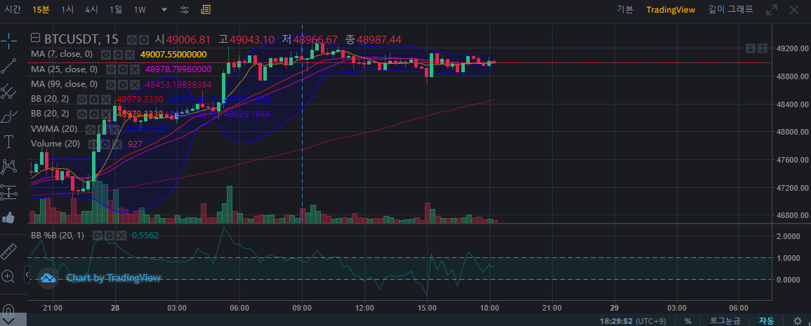
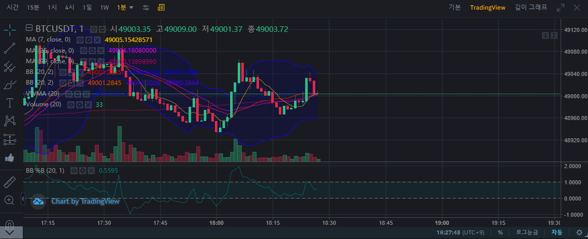
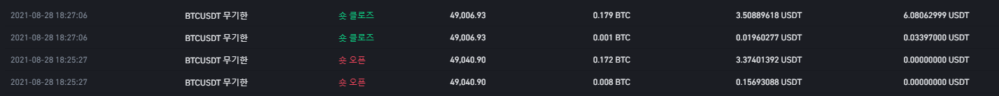
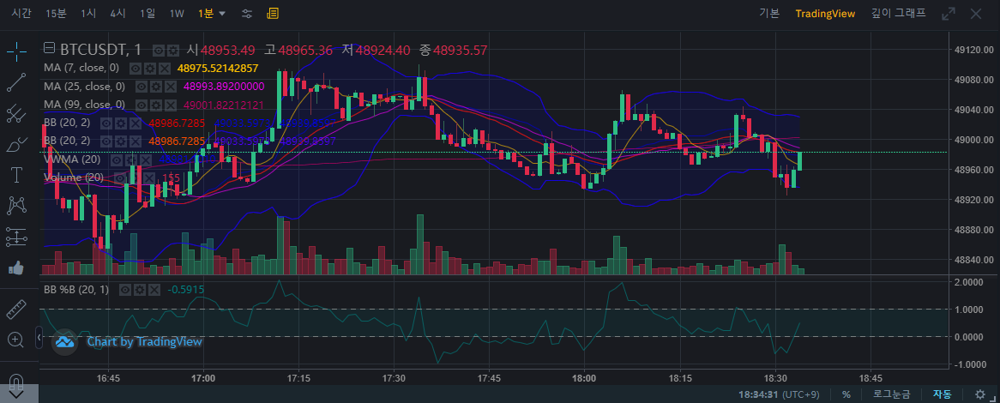
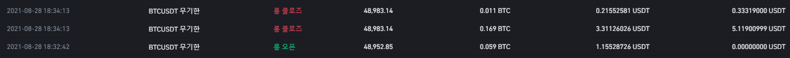
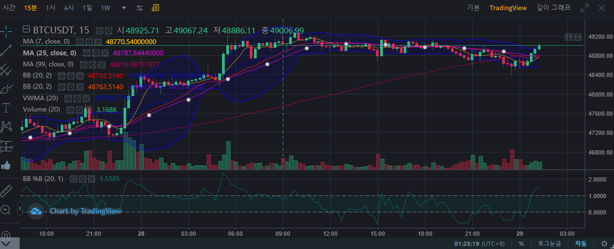

# btc 숏 매수 & 매도

매수 이유: 지속적인 박스권을 이어가고 있었다. 아래로가면 올라가고 올라오면 아래로 가는 패턴이 계속 이어졌다.

수익 6.1

총 수익 6.1

# btc 숏 매수 & 매도

수익 5.4

총 수익 11.5

# btc 롱 매도

# 바이낸스 가격 정책에 
마진 20X를 하게 되었을 때 수수료는 PNL에 나오는 가격이 아니라  
실현 금액 - 수수료를 제외 해야 한다.  
몇 %인지 계산은 ㅇ나했지만 1~2%먹고 손절치면 손해가 나는거 같다.  
이걸 알고 굉장히 오랫동안 물려 있었다.