# [frame]resize to fit
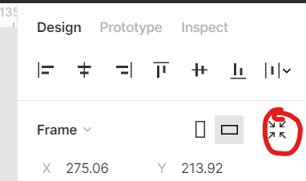

# [group]group color
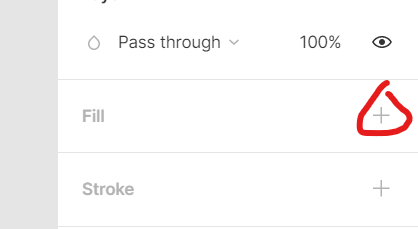

# alt + control + G
프레임 묶기  
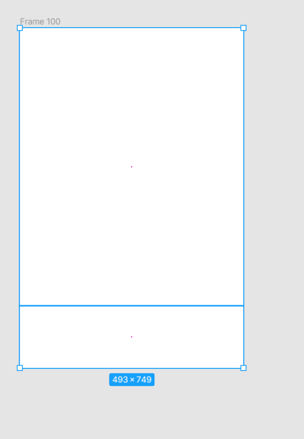

# 두개의 프레임에 라운드 주기
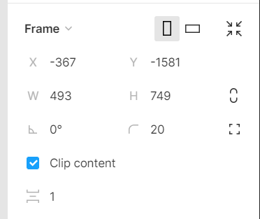

내부에 있는 값을 적용하려고 했는데 안된다!
Clip Content를 이용한다.

# ctrl + 아래 방향키
아래로 1픽셀씩

# ctrl + shift 아래 방향키
아래로 10픽셀씩

# alt + shift 드래그
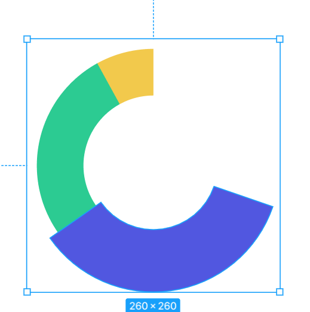

# 프레임에 백그라운드 이미지와 프레임 아래 레이어의 이미지  
프레임에 이미지를 복사하려면 이미지를 선택한 후 다른프레임에 가서 ctrc + v를 하면 된다  

# round to pixel
원형 모형이나 픽셀에 맞지 않는걸 맞춰주는 액션
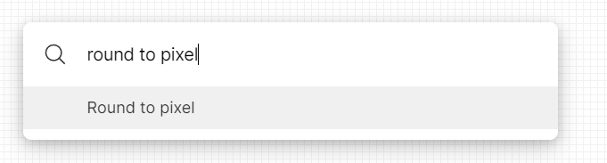

# 패쓰같은것의 사이즈가 남아있어 줄였는데도 여전히 두꺼울 경우
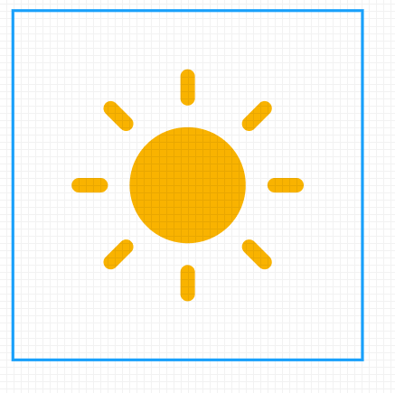

K (스케일 옵션으로 처리를 한다.)  
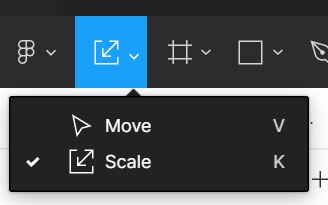

# 패쓰 포인트
ctrl + j  
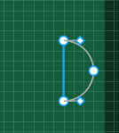

ctrl + 포인트 클릭  무슨 기능인진 모르겠음  약간 평탄화 느낌  
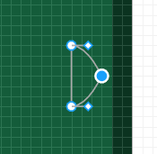

# 렉텡글 두개를 선으로

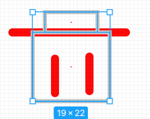
shift + x
inside => center

# 플래튼과 아웃라인 스트로크
아웃라인 스트로크는 사이즈를 조절하면 안에 있는 속성값이 사이즈에 맞게 조절이 되지만
플래튼은 기존 속성을 가지면서 늘어나게 된다.

콘스트레인트