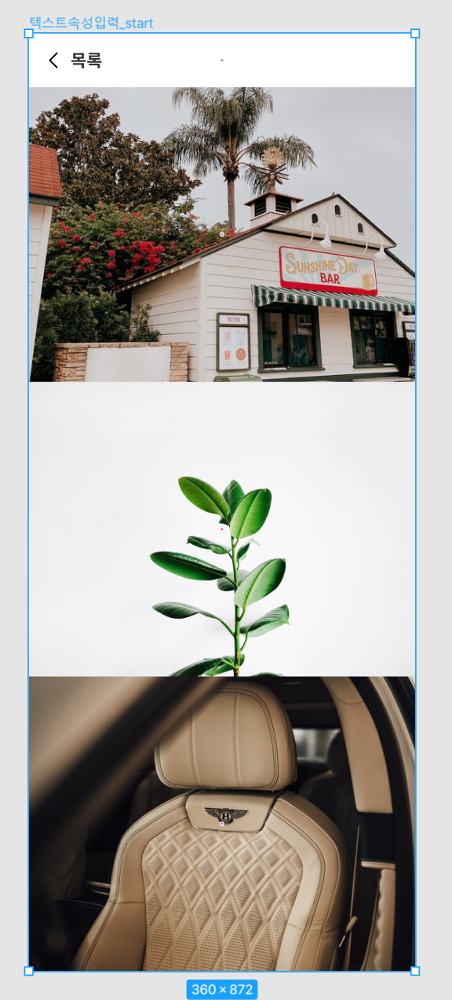
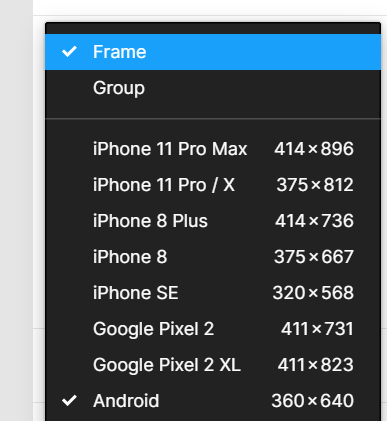
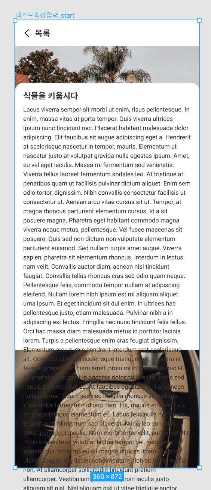
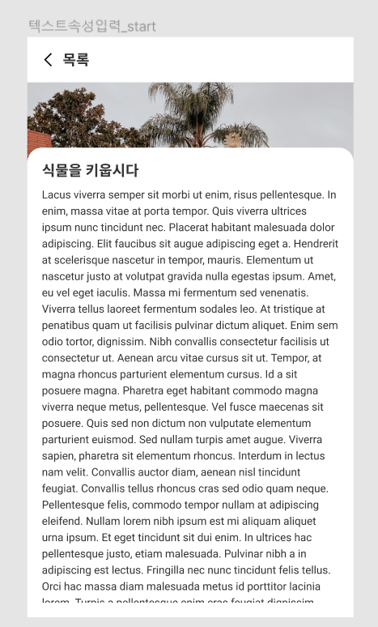
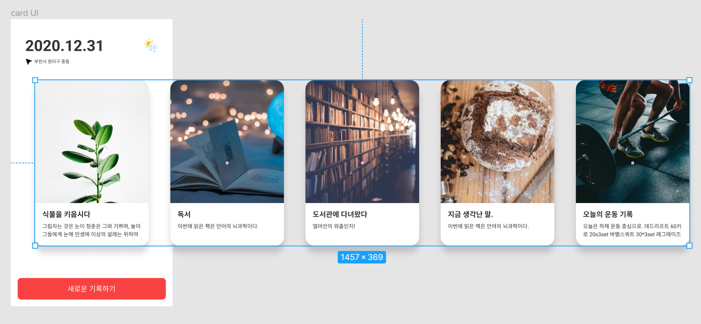
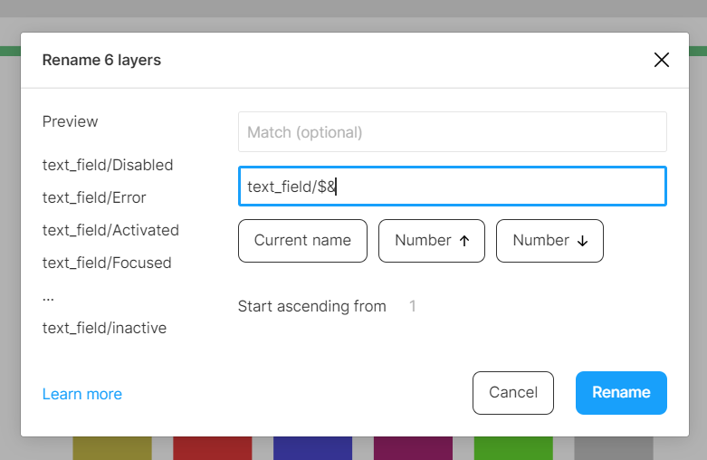

# show present를 했을 때 잘되게 하는 방법

세로 길이가 872 이다  

이 상태에서 다른 옵션 안건드리고 프레젠 테이션을 하면  스크롤링이 된다.

## 근데 프레임 사이즈를 조절을 해 버리면 아래도 다 클립이 되기 때문에 스크롤링이 되지 않는다.

프레임에 클립을 넣어도 동일하다.

## 딱 프레임 사이즈 밖에 스크롤링이 안됨

## 또 이렇게 전부 클립 영역을 하게 되면

스크롤이 안됨  
그래서 프로토 타입에서 스크롤링 옵션을 선택해주면 된다.
 

 ## 가로 스크롤링
 
 왜 이렇게 되어있을 때 스크롤이 쪼금만 될까?

 스크롤링영역은 View영역만큼의 사이즈로만 잡아야 정상적인 스크롤링이 가능하다  
 프로토 타입에서 스크롤링 옵션을 선택

# rename with tag
 

 # 제목 사용하는 행간은 폰트 사이즈의 1.25배
 # 바디 사용하는 행간은 폰트 사이즈의 1.5 ~ 1.75배