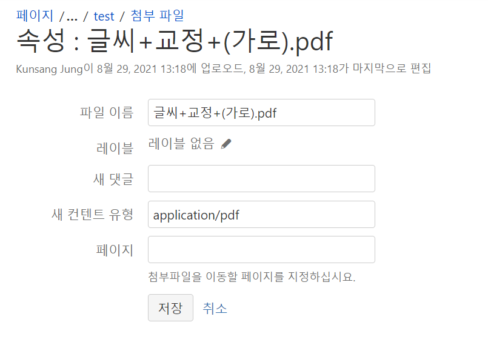

# 페이지 정보

# view file 매크로
/오피스  
/pdf  

# 파일 버져닝
web DAV(Web Distributed Authroing and Versioning)  
파일이름이 같으면 자동으로 버져닝

# 페이지에서 업데이트 해도 되지만 첨부파일안에서 드래그 해서 처리도 가능

# 파일 레이블 

# 첨부파일 매크로
첨부파일관련 '뷰'어  

# 스페이스 관리자 > 내용 도구 > 첨부 파일

# 파일 관리시 주의 사항
1. 첨부 파일이 있는 페이지복사시 첨부도 같이 복사되는점
2. 파일 용도를 알 수 있게 식별 가능한 긴 이름 사용
 - 제안서.pptx -> 2021-06-11-AA프로젝트제안서.pptx로
3. 파일 서버 처럼 1.0.1, 1.0.2를 사용 하지 않는다.
 - 파워포인트, pdf 사용 시 인덱싱을 하게 됨 -> 검색 품질 저하
4. 레이블을 항상 관리하자
5. 공간관리자는 첨부된게 오래됐거나 사용 되지 않느것은 정리를 해 줘야 한다.