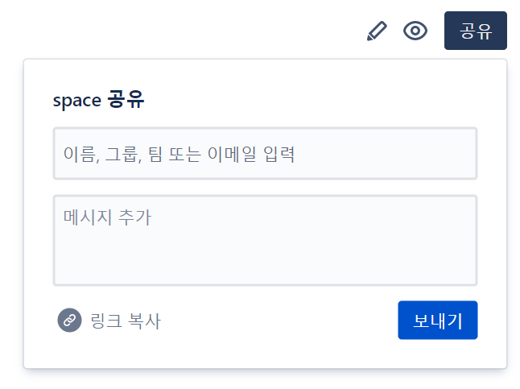

# 공유

# 관찰 - auto watch
1. 페이지를 작성했을 경우  
2. 페이지를 편집했을 경우  
3. 페이지에 댓글을 달았을 때   

자동으로 watch상태가 됨 

이벤트 마다 발생하므로 알림이 가면 페이지 공해
- 관찰자에게 알리지 않고 게시
- 버전 댓글을 포함하여 게시

- 댓글을 달고
- 수정을 하고

# 내가 관찰하는 페이지를 확인하기
  
지켜 보기  
