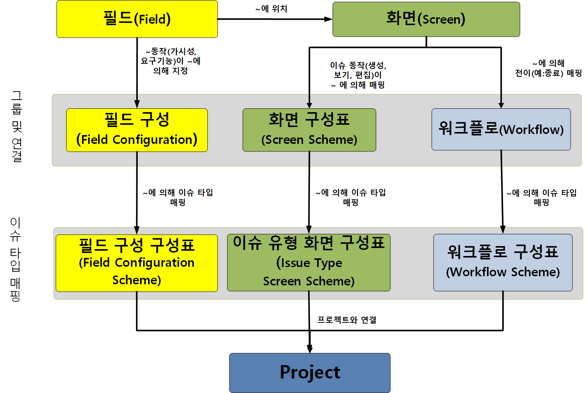
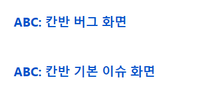
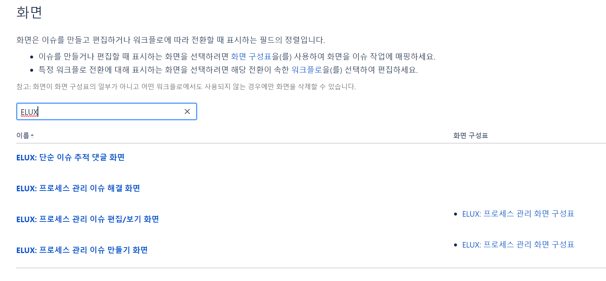
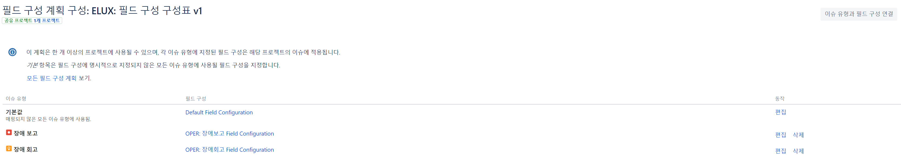
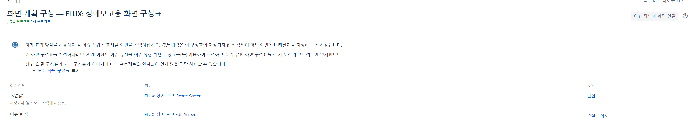
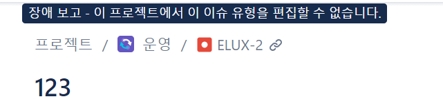

</img>

그림을 보면 이해가 안됨.  

총무팀 이슈 유형  
1. 사무용품 구매
2. 전산비품 구매
3. 도서구매
4. 개선 제안

1, 2를 이슈로 만들고
1, 2를 묶에 이슈 유형 구성표

설정 > 이슈 메뉴 > 이슈 유형 > 신규 이슈 생성
1. 사무용품 구매
2. 전산 비품 구매

설정 > 이슈 유형 구성표
팀-이슈유형-ver으로 이름 관리

프로젝트 생성 > 프로젝트 설정 > 이슈 유형 > 동작에서 구성표 사용 > 위에서 만든 이슈 유형 사용  

이슈 유형은 버그 에픽 하위 작업 같은걸 이슈 유형이라한다.

--- 

이슈유형
1. 작업
2. 장애 보고
3. 장애 회고

장애보고 이슈 유형일 경우 필드
- 상위 보고 여부를 나타내는 라이도 버튼, 필수 필드, 기본 값 false

보고 레벨 필드, 셀렉트 리스트 선택 가능한 값은 팀장, 본부장, CEO이며 필드  
관련자 필드, 여러 사용자들을 선택할 수 있는 multi select user list, 선택 필드

장애 회고 이슈 유형일 경우 필드
- 기술 블로그 게시 필요 여부를 나타내는 라디오 버튼, 선택 필드
- 기술 블로그 게시글 url을 나타내는 url 필드

---

사용자 지정 필드

이슈 만들기  

프로젝트  
이슈유형  
요약
기본 필드  
`빌트인 혹은 시스템 필드라고 함`

사용자 정의 필드 요구사항에 맞게 임의로 설정가능한 필드  
라디오필드 등을 제공

1. 너무 많은 사용자 정의 필드를 만들지 말것 -> 관리 복잡 느려짐
2. 보고를 위한 용도로 필드 사용 -> 어떤 목적으로 사용할지 명확히

고객사에 java버젼정보를 수집하기위해서 **text박스** 보다는 **멀티 셀렉트**를 사용하기는게 유리

3. 중복된 이름 하지 말기
4. 가능하면 일반적인 이름으로 사용 (aa마케팅 정보 -> 마케팅 정보) 너무 특수화 시키지 말것

사용자 지정 필드 설정  
기본값 수정하려면 만들어 놓은 사용자 지정 필드에서 ...눌러 기본값으로 수정  
컨텍스트 및 기본값

---
위에 만든 사용자 정의 필드는 스크린에 연동해야 한다.  
구글 신청서를 작성하는 것을 먼저 생각해보면 참여 여부  

</img>

한개의 프로젝트에 여러개의 화면이 구성 될 수 있다.

</img>

방금 만든 프로젝트에 4개의 스크린이 있음

필드들을 스크린에 넣을 때 많아서 탭을 사용하면 되지만 지라 클라우드에서는 값이 없는건 보이지 않음 권장 X

</img>

이슈 유형: 버그 에픽, 장애 회고, 장애 보고
필드 구성: 장애 보고를 했을 때 어떤 필드로 구성 될지 `필수 영역` 선택

이슈 유형 생성  
이슈 유형 구성표  
사용자 지정 필드  
필드 구성  
필드 구성 구성표  

화면  
화면 구성표  

프로젝트 연결 

---
`화면`에서   
장애 보고용 Create Screen > Copy > 장애 보고용 Edit Screen으로 생성 > 구성 내용에서 제거할 필드 설정

`화면 구성표` 에서

</img>
이슈 작업 > 이슈 편집 에 대한 스크린 연결

</img>
와 같이 이슈 유형을 변경 할 수 없게 만들 수 있다.