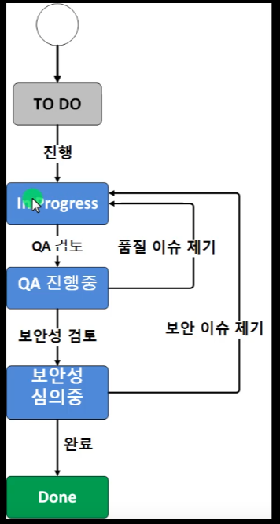
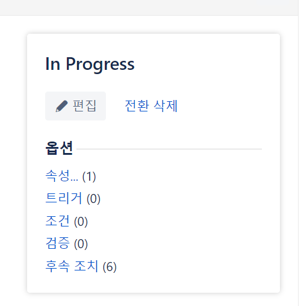
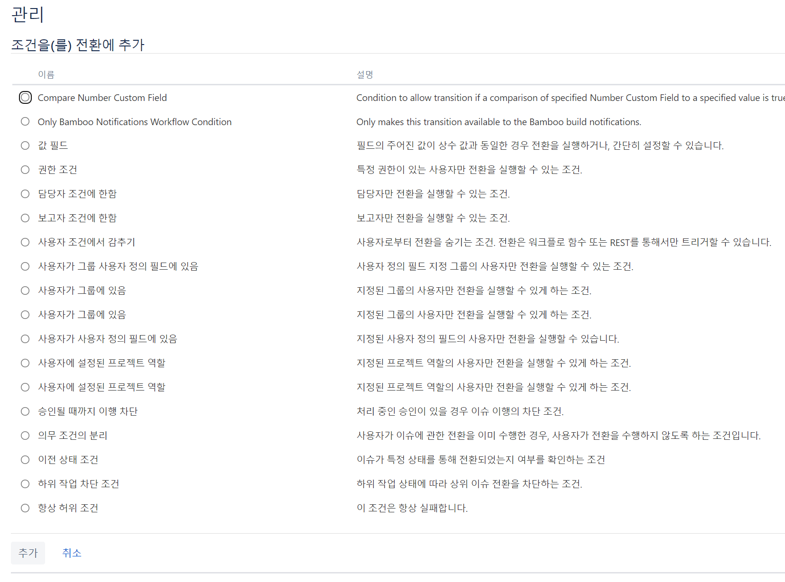
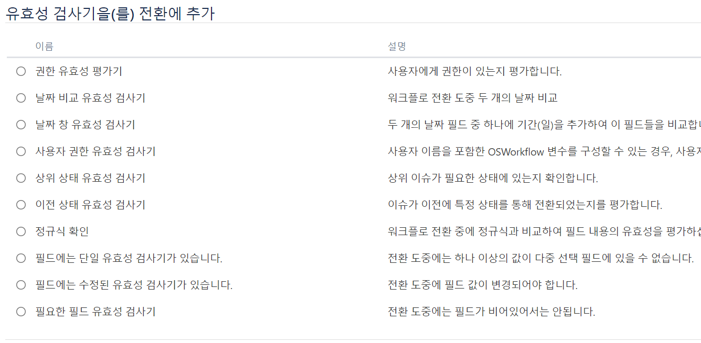
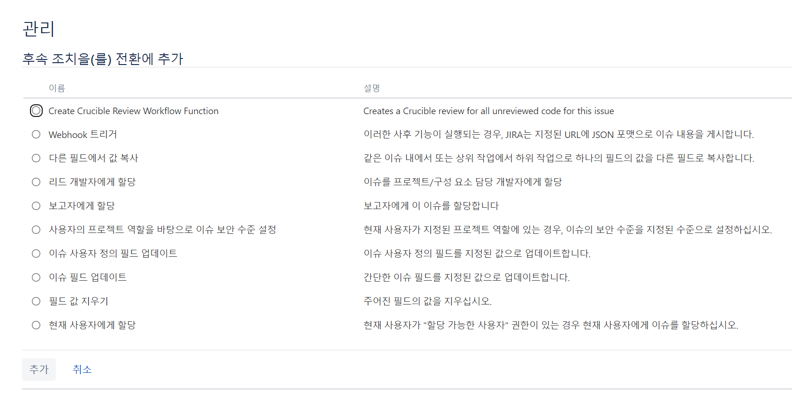
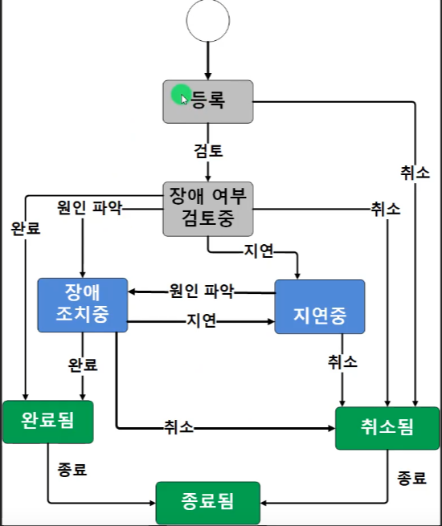
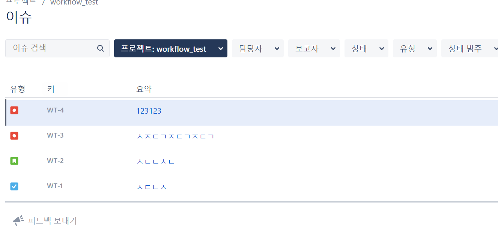
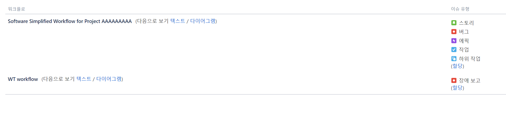

`전환` 이슈가 다른 상태로 이동하는지를 나타냄 

In Progress -> QA 검토 -> 보안성 검토 프로세스

전환의 다섯가지 속성

`속성` 사용을 권장하지 않음!

`트리거` 보다는 Automation For Jira사용 권장 -> 형상관리 내용 풀리퀘스트 브랜치 생성 등등

`조건` 

`검증` 특정 필드 유무를 검색 할 수 있음  

`후속 조치`

---

이슈에는 이렇게 장애 보고에 대한 이슈가 있지만 칸반 보드에서는 보이지 않는다.    
이유는 `스토리와 작업`에 적용 되어잇는 워크플로우와 `장애 보고`에 있는 워크 플로우가 다르기 때문

---
