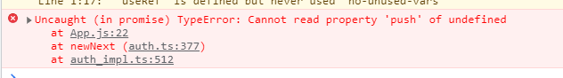

# 로그인 후 처리
* 기본적으로 로그인이 된 후에 이용할 수 있는 페이지로 보내야 함
  * HOC파일을 만들거나
  * app.js에서 구현
      

# 아래 에러 props.history.push했을 때
function App(props) {
}


`useHistory`

let history = useHistory();
이렇게 해줘도 동일 에러가 발생

이유는 App아래 BrowserRouter가 있기 때문
history를 사용하려면


``` jsx
<Router>
    <Switch>
    <Route exact path="/" component={ChatPage} />
    <Route exact path="/login" component={LoginPage} />
    <Route exact path="/register" component={RegisterPage} />
    </Switch>
</Router>
```
->
``` jsx
<Switch>
    <Route exact path="/" component={ChatPage} />
    <Route exact path="/login" component={LoginPage} />
    <Route exact path="/register" component={RegisterPage} />
</Switch>
```
라우터를 제거 해주고

``` jsx
ReactDOM.render(
  <React.StrictMode>
    <Provider store={createStoreWithMiddleware(Reducer, window.__REDUX_DEVTOOLS_EXTENSION__ && window.__REDUX_DEVTOOLS_EXTENSION__())}>
      <BrowserRouter>
        <App />
      </BrowserRouter>
    </Provider>
  </React.StrictMode>,
  document.getElementById('root')
);
```

> \<App>을 Router로 감싸 준다.