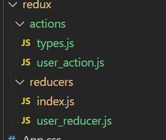

# redux


일단 느낌 나는대로 설명을 하면

1. action이 있다
2. reducer가 있다.
3. dispatch가 있다.
4. store라는것이 있다.  

아래 내용 
1. action이 발생되면 type과 payload를 넘겨준다
2. reducer에서는 combine된 reducer를 사용된다

combineReducer(user, chatting)
user는 userReducer

3. user_reducer는 action type에 따른 switch case가 동작하게 되고
4. initialState라는 정보를 가지고 있고 이 State는 store에 저장되게 된다.

5. dispatch를 해주고
``` ts
const dispatch = useDispatch();
```
6. 저장된 정보는 useSelector에서 가져온다.
```ts
const isLoading = useSelector(state => state.user.isLoading);
```