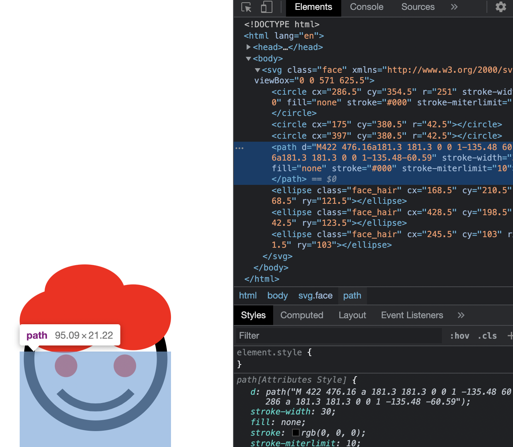

# margin auto를 하면 이게 가운데로 자리를 가지게 된다.

```css
.face {
  position: absolute;
  top: 0;
  right: 0;
  bottom: 0;
  left: 0;
  margin: auto;
  width: 200px;
}
```

margin auto 옵션이 있고 없고
position absoulte가 있고 없고

두개가 다 있어야지 가운데 정렬이 된다.

# 기본적으로 색상을 바꿀 때 background를 사용하지만 svg에서는 fill을 사용한다.

# nth-child()



패스에는 fill명령어가 붙지 않는다.
.face는 svg클래스여서 아래에 있는 circle에 fill스타일이 적용될지 알았는데 적용되지 않고
path를 제외한 다른 자식들에 스타일이 전부 적용되었다.

# nth-of-type

```css
.face_hair:nth-of-type(1) {
  fill: red;
}
```

# transform center center
