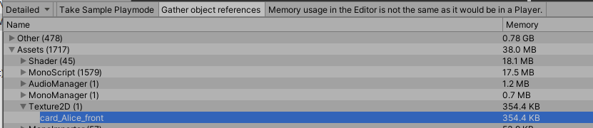
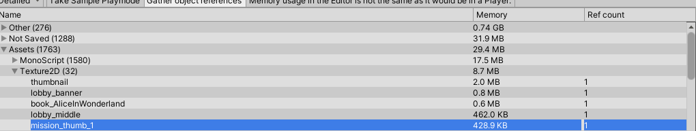
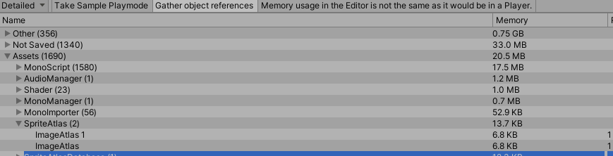

# 스프라이트 아틀라스와 메모리

## 스프라이트 아틀라스를 하면 메모리는 줄을 것인가?

## 번들 리소스를 했을 때 스프라이트 아틀라스를 하면 메모리는 줄을 것인가?

## 어셋 번들이란?

## 어셋 번들을 외부에서 진행할 수 있을까?

1. Resources폴더에 파일들을 올려놓았을때 (사용X)
   
   메모리에 올라가지 않는다.

2. Resources폴더에 파일들을 올려놓고 Resources.LoadAll()을 하면 

8.7메가가 올라간다.

3. Resources폴더에 spriteAtlas를 넣고 Resources.LoadAll을 했어

용량이 늘지 않음

4. 