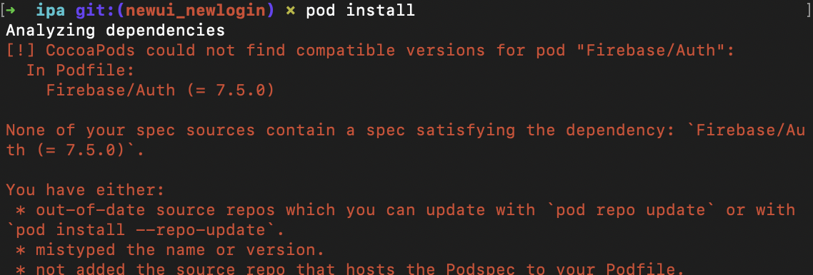
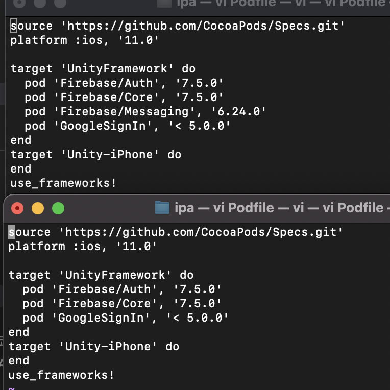
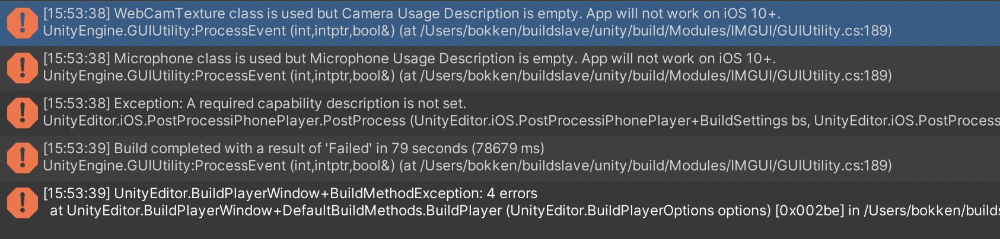
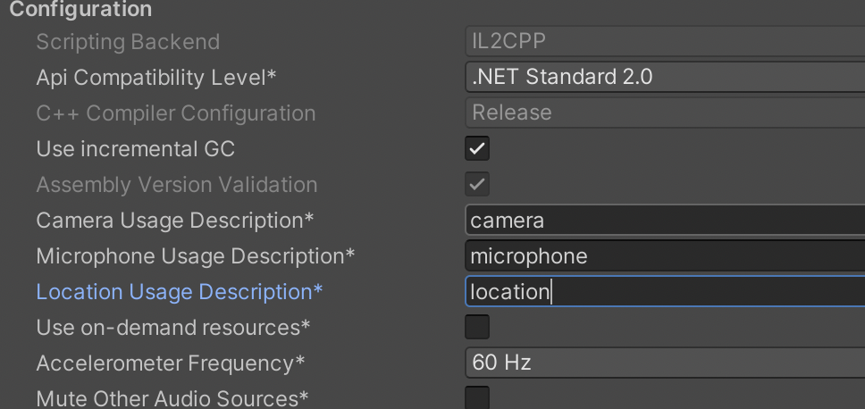

# 스토리 셀프 iOS적용



loginSample빌드하고 런 할때는 문제가 없었는데

storyself에 빌드를 하면 pod install 이 위와같은 이유로 진행 되지 않는다.

---



세팅에서는 fFirebase/Messaging의 유무 차이만 있다.  
그래서 Firebase/Messaging을 삭제하고

pod deintegrate  
pod install  
을 하면 StorySelf역시 제대로 실행이 된다.

Firebase Messaging이 없어서 그런지 google protobuf관련된 에러가 발생했다.  
윈도우에서 유니티 파이어 베이스 관련 messaging패키지를 설치.

전부 초기화한 후에 에러 발생 Purchasing관련된 에러가 발생하는데
Services에서 unity purchasing을 추가해 준다.  
충돌나는 기존 프로젝트에 있는 폴더 삭제

---



Build 세팅에서 문자열만 넣어주면 된다.



IAP패키지 업데이트가 있는데 기존에 설치되어있는 결제 관련 패키지들은 삭제한다.

그거 외에 다른 에러는 그냥 해결할 수 있다.  
RNN관련 노이즈 처리에서 에러나는데 이거는 ios프레임워크 업데이트가 필요하다. 일단 주석처리하면 구글 프로토콜 버퍼 관련해서 에러 undefined

Pod파일에 아래와 같이 수정해서 넣어주면 빌드가 되는것을 확인할 수 있다.

````source 'https://github.com/CocoaPods/Specs.git'
platform :ios, '11.0'

target 'UnityFramework' do
  pod 'Firebase/Auth', '7.5.0'
  pod 'Firebase/Core', '7.5.0'
  pod 'Firebase/Messaging', '7.5.0'
  pod 'GoogleSignIn', '< 5.0.0'
  pod 'Protobuf', '3.14.0'
end
target 'Unity-iPhone' do
end
use_frameworks!```
````

`ProtoBuf를 추가해서 되는지 알았는데 축해서 할 필요가 없다.`

opencv2.framework가 빌드 되는 녀석만 빌드가 된다. 최신에 있는 iOSFrameWork에서는 정상 도작하지 않는다.

일단 이전에 빌드 되던 opencv2.framework로 테스트 진행하기로 했다.
