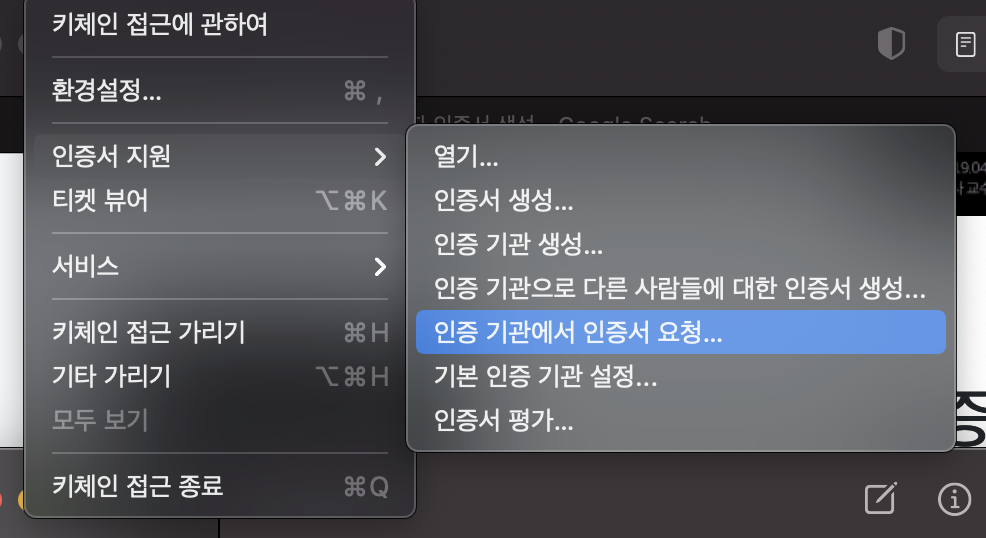
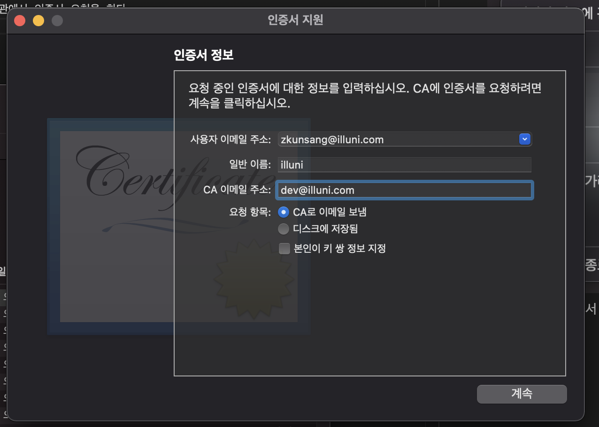
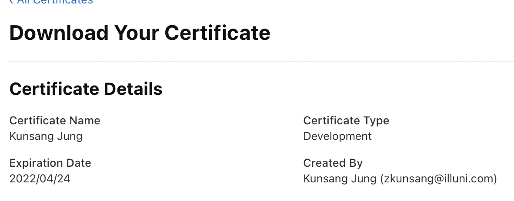
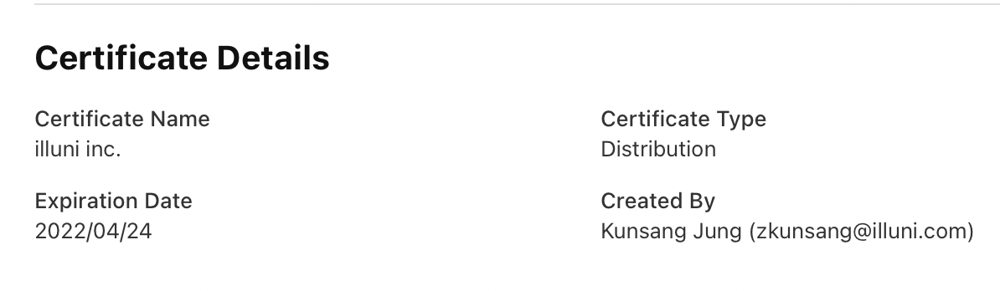
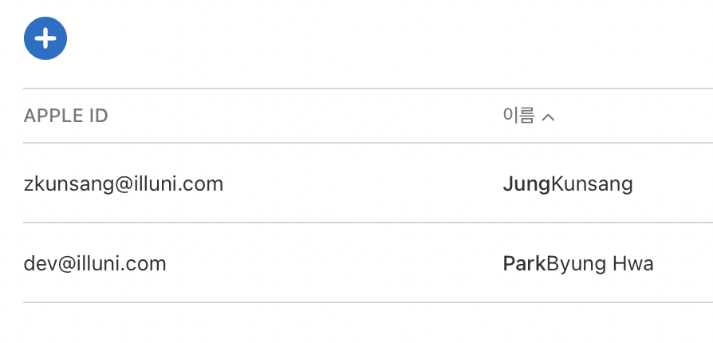

# 애플 개발자 등록하기

키체인 접근으로 가서 인증 기관에서 인증서 요청을 한다.

이런식으로 인증서를 발급 받아보자

이런식으로 인증서를 발급 받아보자

ca이메일로 전송이 아니라 디스크에 저장으로 하자  
ca로 하면 이상하게 오래 걸리고 메일도 안옴

이런 식으로 생성된다.

인증서 Certificate Name을 바꾸고 싶은데 바꿀 수 있는 방법을 모르겠다.
만든 사람 이름으로 이름이 세팅된다.

distribution같은 경우는 illuni inc.으로 나오게 된다.

Distribution같은 경우 Team이름으로 열리고
Development 같은 경우는 이름으로 생성된다.
