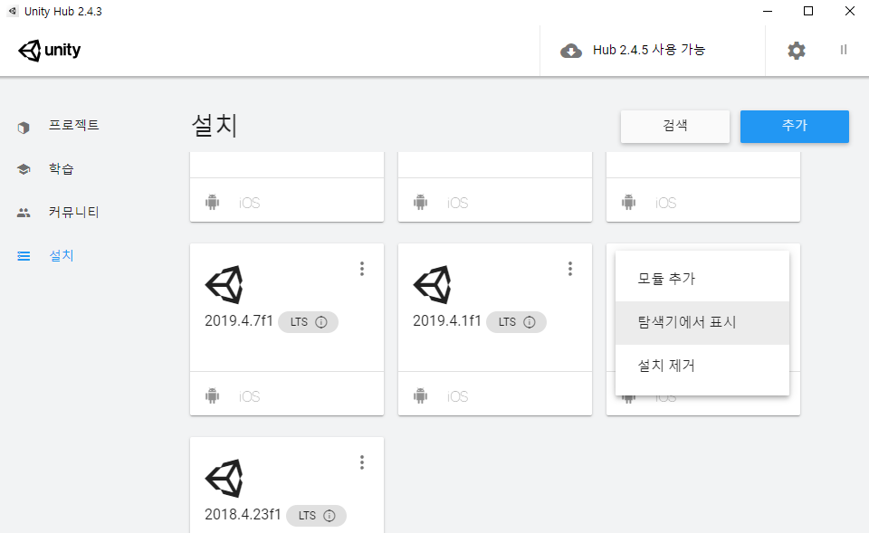
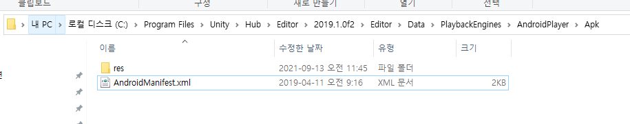

# 안드로이드 메니페스트를 수동으로 추가 하는 방법

https://stackoverflow.com/questions/43293173/use-custom-manifest-file-and-permission-in-unity

You are modifying the wrong AndroidManifest file. That AndroidManifest from <ProjectName>\Temp\StagingArea you are modifying is generated by unity each time you build your project.

유니티 > 설치 > 탐색기에서 표시 >

<UnityInstallationDirecory>\Editor\Data\PlaybackEngines\AndroidPlayer\Apk,

안드로이드 매니페스트 파일을 복사 해서

`<ProjectName>Assets\Plugins\Android`에 추가해준다.
