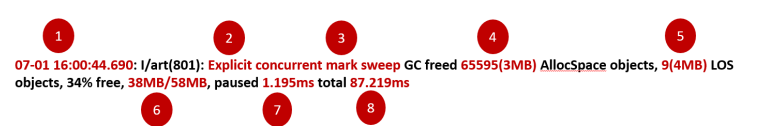

## what is Explicit concurrent copying GC freed

https://blog.gceasy.io/2017/05/09/understanding-android-gc-logs/

# Field Value Description

1 Timestamp 07-01 16:00:44.690 Timestamp at which this Garbage Collection event ran  
2 GC Reason Explicit Reason why Garbage Collection event was triggered. ‘Explicit’ indicates that garbage collection was explicitly requested by an app, for example, by calling gc() or gc(). Please refer here for different types of GC Reasons.  
3 GC Name concurrent mark sweep ART has various different GCs which can get run. In this case, ‘Concurrent Mark Sweep’ indicates – a whole heap collector which frees collects all spaces other than the image space. Please refer here for different types of GC Names.  
4 Objects freed 65595(3MB) Amount of objects garbage collected from non-large objects space. Totally 65595 unique objects, whose cumulative size of 3mb is garbage collected (i.e. freed) in this event.  
5 Large objects freed 9(4MB) Amount of objects garbage collected from Large objects space. Totally 9 unique objects, whose cumulative size of 4mb is garbage collected (i.e. freed)  
6 Heap usage 38MB/58MB 38mb of objects is alive after this particular GC event. Total allocated heap size for this application is 58mb.  
7 GC Pause Time 1.195ms During certain phases of GC event, the application is paused. In this GC event, pause time is 1.195ms. During pause time, application freezes. One should target for low pause time.  
8 GC Total Time 87.219ms Amount of time this GC event took to complete. It includes the GC Pause time as well.
