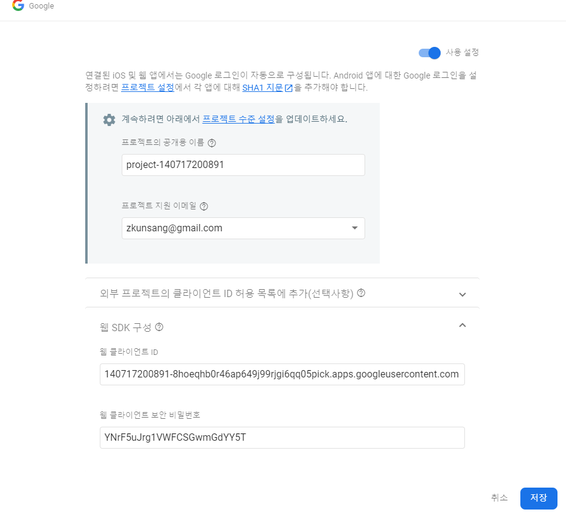
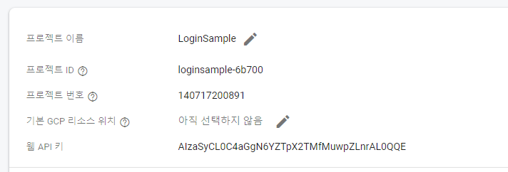
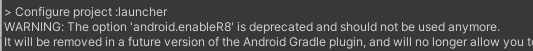
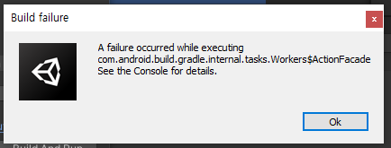
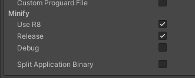
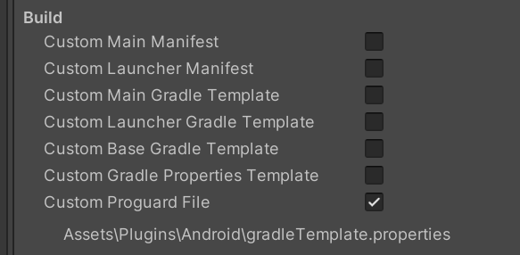
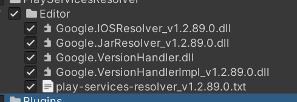
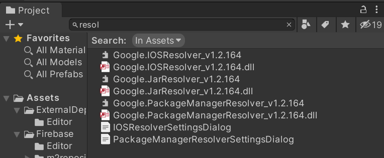

# Authentication(Google)

Android 앱에 대한 Google 로그인을 설정하려면 프로젝트 설정에서 각 앱에 대해 `SHA1 지문` 을 추가해야 합니다.

설정 > 앱 무결성 > `앱 서명 키 인증서` > `sha1 지문` 복사

웹 SDK구성 > 웹 클라이언트 ID는  
**구글 클라우드 플랫폼** `web client`와 동일하다

**파이어베이스** 웹 Api키는  
**구글 클라우드 플랫폼**에 `Android key`와 동일하다.

---

## firebase Auth sdk설치

빌드 시도  
`android.enableR8` 에러 발생

 

`Execution failed for task ':launcher:mergeExtDexRelease'.`

해결책:
https://forum.unity.com/threads/cant-build-with-multidex-enabled.773348/

./buildError.pdf 파일에서 두번째 minify option 에 관련된 답

미니파이 옵션에서 Release를 체크하고 빌드하면 성공한다

## google login for unity sdk설치(google play games X)

엄청나게 알 수 없었던 에러들의 향연

- firebase를 첫번째로 설치
- google login for unity sdk를 이후 설치
- (GLFU)resolver, Unity.TASK, COMPACT? 는 안하고 그 외에 것들만 설치
- "GoogleSignIn_Create" JNI DETECTED ERROR IN APPLICATION
    https://github.com/googlesamples/google-signin-unity/issues/144

프로가드 세팅  

auth.Faluted발생했을 때
업로드 인증서 키 SHA-1을 추가해 준다
`keytool -list -v -keystore .\user.keystore -alias loginsample`로 확인해도 되고
구글 플레이 콘솔에서 확인해도 된다.

이 에러가 통과되면 로그인은 성공하지만 또 다른 에러가 기다리고 있다.

2021-04-04 01:01:28.273 29898 29898 Fatal ang.LoginSampl thread.cc:2355] Throwing new exception 'no non-static method "Lcom/google/android/gms/auth/api/signin/GoogleSignInAccount;.getGivenName()Ljava/lang/String;"' with unexpected pending exception: java.lang.NoSuchMethodError: no non-static method "Lcom/google/android/gms/auth/api/signin/GoogleSignInAccount;.getFamilyName()Ljava/lang/String;"

프로젝트 proguard확인